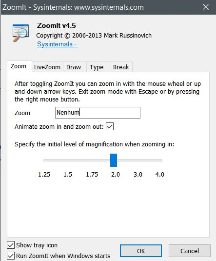

# Zoom it

1. Baixe o [Zoom It](https://docs.microsoft.com/en-us/sysinternals/downloads/zoomit) (Clique no link)
2. Abra o arquivo baixado.
3. Extraia o arquivo *zoomit64.exe* para sua área de trabalho.
4. Clique duas vezes (2x) nele (Arquivo *zoomit64.exe*).
5. Marque a opção:
      - [x] *Run ZoomIt when Windows starts*
      - [x] Tradução: Executar o ZoomIt quando o Windows iniciar.

    

6. Clique no botão <kbd>OK</kbd>

## Tutorial em vídeo

<iframe width="560" height="315" src="https://www.youtube.com/embed/7XYa9q-nXBQ" title="YouTube video player" frameborder="0" allow="accelerometer; autoplay; clipboard-write; encrypted-media; gyroscope; picture-in-picture" allowfullscreen></iframe>

## Ampliação congelada

## Ampliação interativa

Para entrar e sair da ampliação interativa (*LiveZoom*), insira a tecla de atalho:

- <kbd>Ctrl</kbd>+<kbd>4</kbd>

