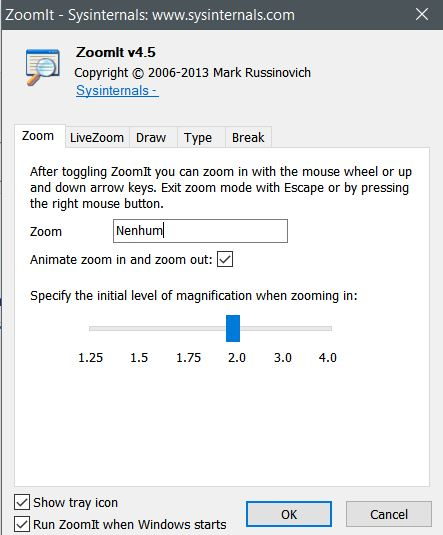

# Instalação -- Zoom it

O ZoomIt é simples. Basta baixá-lo, executá-lo, e, caso goste dele, marque-o para execução automática quando você iniciar o Windows.

1. Baixe o [Zoom It](https://live.sysinternals.com/ZoomIt64.exe) (Clique no link)
2. Execute o arquivo baixado.
3. Marque a opção:
      - [x] *Run ZoomIt when Windows starts*
      - [x] Tradução: Executar o ZoomIt quando o Windows iniciar.

    

4. Clique no botão <kbd>OK</kbd>.

Feito isso, experimente:

- [Ampliação congelada](ampliacao/congelada.md)
- [Desenho](desenho.md)
- [Teclas de atalho](atalhos.md)
- [Ampliação interativa](ampliacao/interativa.md)
